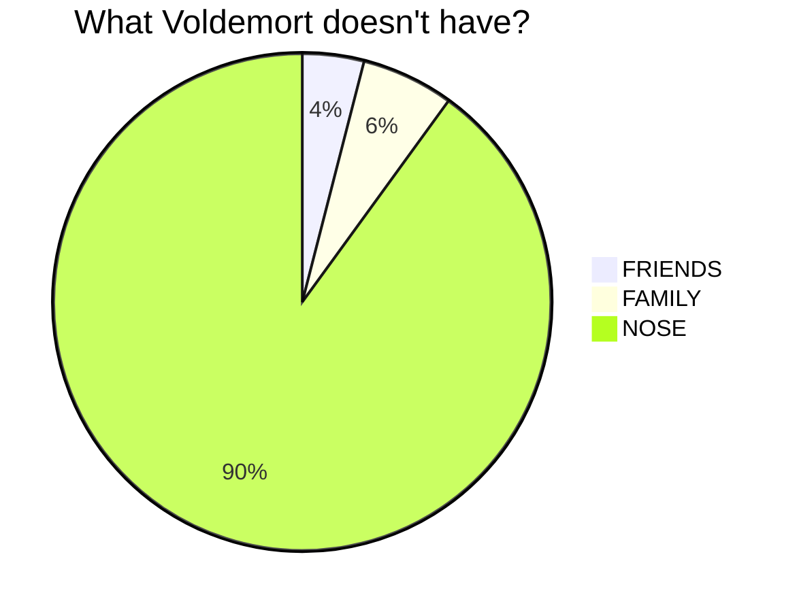

- [&#60;nfdi-navbar&#62;](#nfdi-navbar)
- [&#60;nfdi-footer&#62;](#nfdi-footer)
- [&#60;nfdi-body&#62;](#nfdi-body)
- [&#60;nfdi-sidebar-element&#62;](#nfdi-sidebar-element)
- [&#60;nfdi-sidebar-eleneo&#62;](#nfdi-sidebar-eleneo)
- [&#60;nfdi-header&#62;](#nfdi-header)
- [&#60;nfdi-toc&#62;](#nfdi-toc)
- [&#60;nfdi-code&#62;](#nfdi-code)

## Style

### Based on Bulma

The DataPLANT web components were built with the basic Bulma style sheet in mind. It is highly recommended to reference the Bulma style sheet for all projects which use the DataPLANT web components.

```html
<link rel="stylesheet" href="https://cdn.jsdelivr.net/npm/bulma@0.9.4/css/bulma.min.css">
```

*Or see [here](https://bulma.io/documentation/overview/start/) for the official docs.*

### Custom Properties -  CSS variables

Nearly all web components come with the possibility to change the default color scheme by applying custom CSS variables to the html document. Each web component comes with a description of available variables and their default values.
If you are using the `nfdi-body` for documentation it is highly recommended to use the following css snippet to apply a consistent styling to the child elements inside the body.

```css
nfdi-toc, nfdi-body {
    --outside-background-color: rgb(240, 243, 246);
    --header-color: rgb(10, 12, 16)
    --element-text-color: #0E1116;
    --element-background-color: #fff;
    --accent-text-color: rgb(31, 194, 167);
    --link-color: #4FB3D9;
    --link-hover-color: #8ad3ee;
}

body {
    margin: 0px;
}

thead tr th, strong {
    color: var(--accent-text-color) !important
}

a {
    color: var(--link-color, #4FB3D9) !important;
}

a:hover {
    color: var(--link-hover-color, #3A3A3A) !important;
}

thead {
    font-size: 1.2rem;
}
```

## nfdi-navbar

```html
<script type="text/plain"><nfdi-navbar></nfdi-navbar></script>
```

<br>


*v0.8.0*

Slotless component with responsive design at 1024px media query. Fixed top and requires `padding-top: 3.25rem` to be added to html.

```html
<script type="text/plain"><html style="padding-top: 3.25rem"></html></script>
```

### Custom Properties

- `--element-background-color`, set "background-color" of navbar. (Default: [nfdi-darkblue])
- `--element-text-color`, set "color", "border-color" and "navbar-divider" color. (Default: [nfdi-white][nfdi-basecolor])

## nfdi-footer

```html
<script type="text/plain"><nfdi-footer></nfdi-footer></script>
```

<br>


*v0.8.0* 

Slotless component.

### Custom Properties

- `--element-background-color`, set "background-color" of footer.(Default: [nfdi-darkblue 20% lighter][nfdi-darkblue])
- `--element-text-color`, set "color", "border-color". (Default: [nfdi-white][nfdi-basecolor])
- `--link-color`, set color of links. (Default: [nfdi-lightblue][nfdi-lightblue])
- `--link-color`, set :hover color of links. (Default: [nfdi-black][nfdi-basecolor])
- `--header-color`, set color to html header elements. (Default: [nfdi-white][nfdi-basecolor])

## nfdi-body

```html
<script type="text/plain"><nfdi-body [class="content"] [hassidebar="true"]></nfdi-body></script>
```

The top level container element for the main documentation design.


*v0.5.2*

This element will contain all documentation content in its "Main Content Area". To style it's children in this area, use the bulma class `class="content"`. 

**Features**
- Hide sidebar at 1024px media query and show fixed bottom footer to open sidebar area on touch/click.
    - Sidebar will slide into view.

### Slots

Child elements will go to "Main Content Area"

```html
<nfdi-body class="content" hassidebar="true">
    <h1 class="front-header">Index</h1>
    <i class="help">last updated at 2022-06-06</i>
</nfdi-body>
```

#### **sidebar-slot**
Use this slot to specify an [nfdi-sidebar-element](#nfdi-sidebar-element).

```html
<nfdi-body class="content" hassidebar="true">
    <!-- searchbar slot, pagefind example -->
    <div slot="searchbar"> 
        <link href="/_pagefind/pagefind-ui.css" rel="stylesheet">
        <script src="/_pagefind/pagefind-ui.js" type="text/javascript"></script>
        <div id="search"></div>
        <script>
            window.addEventListener('DOMContentLoaded', (event) => {
                new PagefindUI({ element: "#search" });
            });
        </script>
    </div>
    <!-- sidebar slot -->
    <nfdi-sidebar-element slot="sidebar" isactive="true">
        <div slot="title">General</div>
        <h1 slot="inner"><a href="/index.html">Home</a></h1>
    </nfdi-sidebar-element>
</nfdi-body>
```

#### **searchbar-slot**
Use this slot to set an element above all sidebar links.

```html
<nfdi-body class="content" hassidebar="true">
    <!-- searchbar slot, pagefind example -->
    <div slot="searchbar"> 
        <link href="/_pagefind/pagefind-ui.css" rel="stylesheet">
        <script src="/_pagefind/pagefind-ui.js" type="text/javascript"></script>
        <div id="search"></div>
        <script>
            window.addEventListener('DOMContentLoaded', (event) => {
                new PagefindUI({ element: "#search" });
            });
        </script>
    </div>
```

### Html Attributes

- `hasSidebar`/`hassidebar`: set to "true" to display the sidebar. (Default: "false")

### Custom Properties

- `--outside-background-color`, set "background-color" of are outside of box.(Default: [nfdi-olvi 80% lighter][nfdi-olive])
- `--element-text-color`, set "color", "border-color". (Default: [nfdi-black][nfdi-basecolor])

## nfdi-sidebar-element

```html
<script type="text/plain"><nfdi-sidebar-element slot="sidebar" [isActive=true]></nfdi-sidebar-element></script>
```

<br>

Stackable element in "Sidebar Area> of body. MUST be slotted in "sidebar" slot of `nfdi-body`.

**Features**:
- Can be opened or closed on click.
- Automatically highlights active pages (host + path).
    - Automatically hightlights in-page links when scrolled by.

## nfdi-sidebar-eleneo

```html
<nfdi-sidebar-eleneo slot="sidebar">
    <a href="/">Theory</a>
    <a href="/#" slot="child">Metadata</a>
    <a href="/#what-is-metadata-amp-more" slot="child">What is metadata?</a>
    <a href="/#where-does-metadata-come-from" slot="child">Where does metadata come from?</a>
    <a href="/#why-do-i-benefit-from-metadata" slot="child">Why do I benefit from metadata?</a>
    <nfdi-sidebar-eleneo slot="child">
        <a href="/#what-tasks-are-important-for-rich-metadata">What tasks are important for rich metadata?</a>
        <a href="/#collection" slot="child">Collection</a>
        <a href="/#structuring" slot="child">Structuring</a>
        <a href="/#sharing-and-curation" slot="child">Sharing and curation</a>
    </nfdi-sidebar-eleneo>
</nfdi-sidebar-eleneo>
```

<br>

Stackable element in "Sidebar Area" of body. MUST be slotted in "sidebar" slot of `nfdi-body`.


*v1.0.0*

**Features**:
- Can be opened or closed on click.
- Automatically highlights active pages (host + path).
- Can be nested to increase nesting depth.

### Slots

```html
<nfdi-sidebar-eleneo slot="child">
    <a href="/#what-tasks-are-important-for-rich-metadata">What tasks are important for rich metadata?</a>
    <a href="/#collection" slot="child">Collection</a>
    <a href="/#structuring" slot="child">Structuring</a>
    <a href="/#sharing-and-curation" slot="child">Sharing and curation</a>
</nfdi-sidebar-eleneo>
```

#### **main**
Use this slot for the main link.
- MUST be `<a>` tag. MUST contain `href` attribute.
- Will be checked for mathing path to windowlocation to automatically open active subpages.

#### **child-slot**
Use this slot to create a toggable sub-container which contains child links. 
- MUST be `<a>` or `<nfdi-sidebar-eleneo>` tag. MUST contain `href` attribute.
- Will be checked for mathing path to windowlocation to automatically open active subpages.

### Html Attributes

- `isActive`/`isactive`: set to "true" to display the element open. (Default: "false")

### Custom Properties

- `--accent-text-color`, set color of dropdown angle. (Default: [nfdi-black][nfdi-basecolor])
- `--sidebar-text-color`, set text color of all slots. (Default: [nfdi-black][nfdi-basecolor])
- `--element-background-color`, set on hover color for sidebar links (Default: [nfdi-darkblue][nfdi-darkblue])

## nfdi-header

```html
<script type="text/plain"><nfdi-h1>Metadata</nfdi-h1>
<nfdi-h2>Metadata 2</nfdi-h2>
<nfdi-h3>Metadata 3</nfdi-h3>
<nfdi-h4>Metadata 4</nfdi-h4>
<nfdi-h5>Metadata 5</nfdi-h5>
<nfdi-h6>Metadata 6</nfdi-h6></script>
```

<br>


*v0.5.2*

Use with one child element as text. Will propagate html.

**Features**
- Automaticly creates in-page (/#in-page-link) link before header.
- Automaticly creates id corresponding to in-page link for header.

### Custom Properties

- `--link-color`: set color of generated in-page link. (Default: [nfdi-lightblue][nfdi-lightblue])
- `--link-hover-color`: set hover color of generated in-page link. (Default: [nfdi-black][nfdi-basecolor])
- `--header-color`: set color to header elements. (Default: [nfdi-black][nfdi-basecolor]) 

## nfdi-toc

```html
<script type="text/plain"><nfdi-toc></nfdi-toc></script>
```

<br>


*v0.5.2*

Slotless component to automatically create table of contents.

**Features**
- Finds all [`nfdi-header`](/#nfdiheader) in `nfdi-body`, nests them according to lowest depth and creates `<ul>`, `<li>` elements with the in-page links.

**Known Issues**
- Automatic generation has some major restrictions:
    - Only works on elements inside the next lowest nfdi-header level :bug:.
    - Example: 'header h2' will be missing.
      ```html
      <script type="text/plain"><nfdi-h2>header h2</nfdi-h2>
      <nfdi-h1>header h1.1</nfdi-h1>
      <nfdi-h1>header h1.1</nfdi-h1></script>
      ```
    - Example: 'header h3' will be missing.
      ```html
      <script type="text/plain"><nfdi-h1>header h1.1</nfdi-h1>
      <nfdi-h2>header h3</nfdi-h2>
      <nfdi-h1>header h1.2</nfdi-h1>
      <nfdi-h2>header h2</nfdi-h2></script>
      ```
    - 👀 If you are interested, any help is welcome ([here](https://github.com/nfdi4plants/web-components/issues/15)).

### Custom Properties

- `--link-color`: set color of generated in-page links. (Default: [nfdi-lightblue][nfdi-lightblue])
- `--link-hover-color`: set hover color of generated in-page links. (Default: [nfdi-black][nfdi-basecolor])
- `--element-text-color`: set color to list style elements. (Default: [nfdi-black][nfdi-basecolor]) 

## nfdi-code

```html
<script type="text/plain"><nfdi-code></nfdi-code></script>
```


*v0.6.0*

Example Mermaid Graph (>0.13.0)



This component can be used to display code snippets similar to `<pre>` html elements. Any text inside will be presented exactly as written.

Add `class="language-*"` to the element to specify the language for syntax highlighting.

👀 If you want to showcase html code, it is recommended to add a `<script>` tag.

```html
<nfdi-code class="language-html"><script type="text/plain"><p>Hi!</p></script></nfdi-code>
```

**Features**
- Comes with copy-to-clipboard button.
- Inlcuded line numbers and [prismjs](https://prismjs.com) syntax highlighting. Supports syntax highlighting for:
    - `markup`, `html`, `xml`, `css`
    - `JSON`, `YAML`
    - `fsharp`, `csharp`, `clike`
    - `javascript`, `typescript`
    - `bash`
    - `markdown`
    - `python`
- Supports [mermaid graphs](https://github.com/mermaid-js/mermaid#examples) (>v0.12.0)

### Slots

```html
<script type="text/plain"><nfdi-body>
    <nfdi-code class="language-fsharp">#r "nuget: DynamicObj, 1.0.1"
#r "nuget: Expecto, 9.0.4"

open DynamicObj
open Newtonsoft.Json
open System.IO
open Microsoft.FSharp.Core

type JsonParser = {
    TokenType: JsonToken
    Value: string option
} with
    static member create tokenType value = {
        TokenType = tokenType
        Value = value
    }</nfdi-code>
</nfdi-body></script>
```

### Custom Properties

- `--accent-text-color`: set the colored border on the left. (Default: [nfdi-lightblue][nfdi-lightblue])
- `--outside-background-color`: set background-color. (Default: [nfdi-white][nfdi-basecolor])
- `--element-text-color`: set copy-button border-color and box-shadow color. (Default: [nfdi-white][nfdi-basecolor]) 

[nfdi-darkblue]: https://github.com/nfdi4plants/Branding#darkblue
[nfdi-lightblue]: https://github.com/nfdi4plants/Branding#lightblue
[nfdi-olive]: https://github.com/nfdi4plants/Branding#lightblue
[nfdi-basecolor]: https://github.com/nfdi4plants/Branding#lightdark-base-colors
